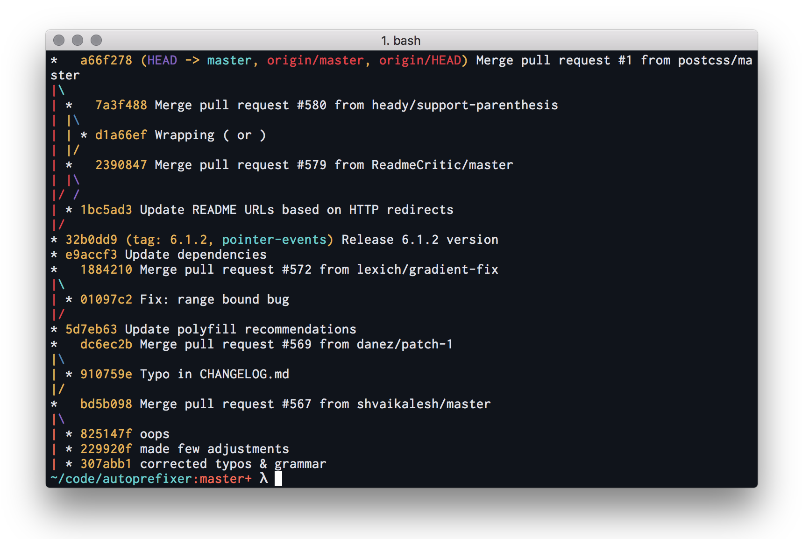

# atelier-ocean
A dark shell theme that blends the best of atelier themes with ocean hues.

## How to install

1. Clone the repository `git clone git://github.com/stephenway/atelier-ocean.git`
2. Open the `atelier-ocean.terminal` or `atelier-ocean.itermcolors` file to install.
3. Optionally open up Terminal or iTerm  preferences for more options.

## License
This project is not licensed and is free for anyone to use.
